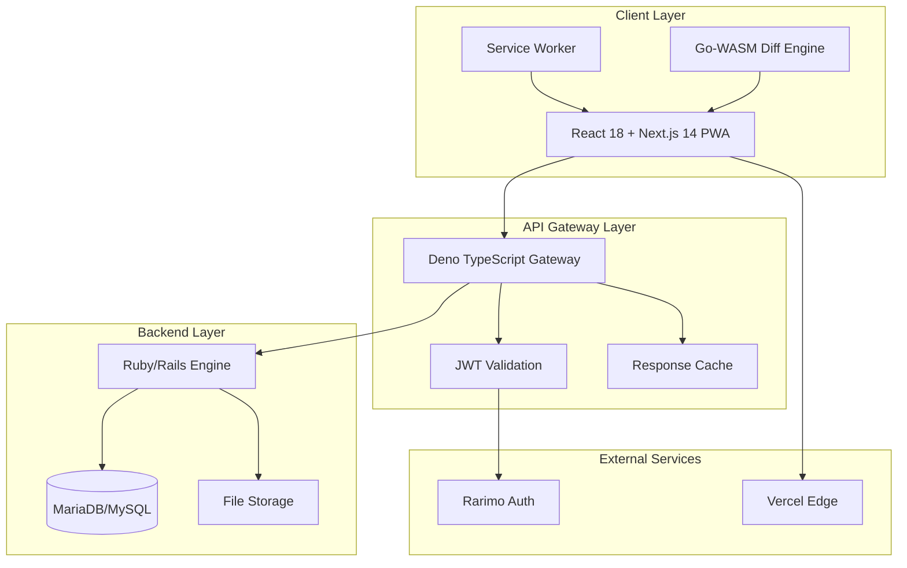
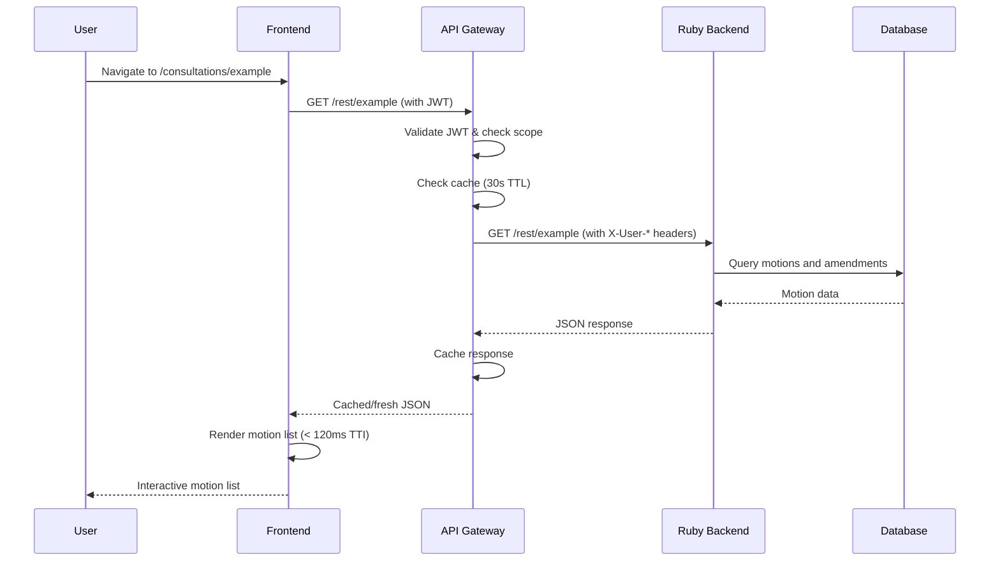
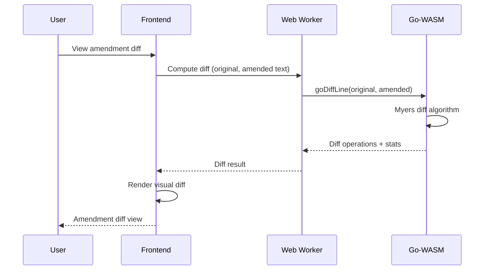

# Antragsgrün Modern Architecture

## Overview

This document outlines the new modern architecture for Antragsgrün, transitioning from a monolithic Ruby/Twig application to a mobile-first Single Page Application (SPA) with a stateless API gateway, while retaining the battle-tested motion-and-amendment engine as a headless service.

## Architecture Principles

### 1. Separation of Concerns
- **Frontend**: React 18 + Next.js 14 SPA for user interface
- **API Gateway**: Deno TypeScript proxy layer for authentication and caching
- **Backend**: Existing Ruby/Rails engine (unchanged) for business logic

### 2. Mobile-First Design
- Progressive Web App (PWA) with offline capabilities
- Responsive design optimized for mobile devices
- Performance budget: ≤ 150 kB critical JS, ≤ 200 kB first HTML

### 3. Performance Requirements
- **Time to Interactive (TTI)**: < 120 ms for 10,000-row motion list on Moto G Power (2G network)
- **API Response Time**: < 5 ms median P99 latency
- **Round-trip Time**: < 2 seconds for amendment submission to Rails DB
- **Lighthouse PWA Score**: ≥ 90 mobile

### 4. Security & Authentication
- JWT-based authentication via Rarimo identity provider
- Stateless API design (no Rails session cookies)
- Scope-based authorization (`motion.read`, `motion.write`, `admin`)

## System Architecture



## Component Details

### Frontend (React + Next.js)

**Location**: `frontend/`

**Technology Stack**:
- React 18 with concurrent features
- Next.js 14 with App Router
- TypeScript (strict mode)
- Tailwind CSS with RTL support
- SWC for fast compilation
- Vite plugins for WebAssembly

**Key Features**:
- File-system routing with Next.js App Router
- Server-side rendering (SSR) and static generation (SSG)
- WebAssembly integration for CPU-intensive operations
- Progressive Web App capabilities
- Offline-first design with Service Worker

**Performance Optimizations**:
- Code splitting and lazy loading
- Image optimization with Next.js Image component
- Bundle analysis and tree shaking
- Critical CSS inlining
- Resource preloading and prefetching

### API Gateway (Deno)

**Location**: `api-gateway/`

**Technology Stack**:
- Deno 1.43+ runtime
- Oak web framework
- TypeScript (native support)
- JOSE for JWT handling
- Standard library for caching

**Responsibilities**:
- Proxy all OpenAPI endpoints to Ruby backend
- JWT validation and scope checking
- Response caching (30-second TTL for GET requests)
- Request/response transformation
- CORS handling
- Request logging and monitoring

**Authentication Flow**:
1. Frontend obtains JWT from Rarimo
2. API Gateway validates JWT signature and claims
3. User context passed to Ruby backend via headers
4. Scope-based access control enforced

### Backend (Ruby/Rails)

**Location**: Existing codebase (unchanged)

**Integration Points**:
- OpenAPI 3.0 specification (`docs/openapi.yaml`)
- REST endpoints under `/rest/` path
- User context received via `X-User-*` headers
- Existing database schema and business logic

### Go-WASM Diff Engine

**Location**: `frontend/src/wasm/diff/`

**Purpose**:
- High-performance text diffing using Myers algorithm
- Line-accurate, O(N) complexity
- Character-level and line-level diff computation
- Patch generation and application

**API**:
- `goDiffChar(oldText, newText)`: Character-level diff
- `goDiffLine(oldText, newText)`: Line-level diff with character details
- `goPatch(oldText, newText)`: Generate patch
- `goApplyPatch(text, patch)`: Apply patch

## Data Flow

### Motion List Rendering



### Amendment Diff Computation



## Development Workflow

### Frontend Development
```bash
cd frontend/
npm install
npm run dev                 # Start development server
npm run codegen             # Generate API types from OpenAPI
npm run lint                # ESLint + Prettier
npm run test                # Vitest unit tests
npm run test:e2e            # Playwright E2E tests
```

### API Gateway Development
```bash
cd api-gateway/
deno run --allow-net --allow-read --allow-env --watch main.ts
deno test --allow-net --allow-read --allow-env
deno lint
deno fmt
```

### Go-WASM Build
```bash
cd frontend/src/wasm/diff/
chmod +x build.sh
./build.sh                 # Generates diff.wasm and wasm_exec.js
```

## Deployment Strategy

### Frontend (Vercel)
- **Development**: Preview deployments on pull requests
- **Production**: Automatic deployment from `main` branch
- **Edge Functions**: For API routes and middleware
- **Global CDN**: Static assets served from edge locations

### API Gateway (Containerized)
- **Docker**: Multi-arch images (AMD64, ARM64)
- **Registry**: GitHub Container Registry
- **Orchestration**: Kubernetes or Docker Compose
- **Scaling**: Horizontal auto-scaling based on CPU/memory

### Backend (Existing)
- Ruby/Rails application remains unchanged
- Existing deployment process maintained
- Database migrations handled by Rails

## Monitoring & Observability

### Performance Metrics
- **Frontend**: Lighthouse CI, Core Web Vitals, bundle size analysis
- **API Gateway**: Response time percentiles, throughput, error rates
- **Backend**: Existing Rails monitoring (unchanged)

### Error Tracking
- **Frontend**: Sentry for client-side errors
- **API Gateway**: Structured logging to stdout
- **Backend**: Existing Rails error handling

### Health Checks
- `/health` endpoint on API Gateway
- Kubernetes readiness and liveness probes
- Uptime monitoring with external services

## Security Considerations

### Authentication & Authorization
- JWT tokens with short expiration (15 minutes)
- Refresh token rotation
- Scope-based access control
- Rate limiting on sensitive endpoints

### Data Protection
- HTTPS everywhere (TLS 1.3)
- Content Security Policy (CSP)
- Cross-Origin Resource Sharing (CORS) properly configured
- Input validation and sanitization

### Dependencies
- Automated security scanning (Dependabot, Snyk)
- Regular updates and vulnerability assessments
- Supply chain security (package integrity verification)

## Migration Strategy

### Phase 1: Infrastructure Setup
1. Set up CI/CD pipelines
2. Deploy API Gateway alongside existing Rails app
3. Configure authentication with Rarimo
4. Set up monitoring and logging

### Phase 2: Frontend Replacement
1. Build React components for core features
2. Implement motion list and detail views
3. Add amendment diff functionality
4. Progressive migration of user-facing pages

### Phase 3: Performance Optimization
1. Implement Service Worker for offline capabilities
2. Add WebAssembly diff engine
3. Optimize bundle size and loading performance
4. Conduct load testing and optimization

### Phase 4: Full Cutover
1. Update DNS to point to new frontend
2. Deprecate old Twig templates
3. Monitor and optimize performance
4. Gather user feedback and iterate

## Performance Budget

### JavaScript
- **Critical Path**: ≤ 150 kB (gzipped)
- **Total Bundle**: ≤ 500 kB (gzipped)
- **Third-party Scripts**: ≤ 100 kB (gzipped)

### HTML
- **First Load**: ≤ 200 kB (gzipped)
- **Subsequent Pages**: ≤ 100 kB (gzipped)

### Images
- **WebP/AVIF**: Modern formats with fallbacks
- **Responsive Images**: Multiple sizes for different viewports
- **Lazy Loading**: Below-the-fold images

### API Response Times
- **P50**: < 2 ms
- **P95**: < 5 ms
- **P99**: < 15 ms (stretch: migrate to Rust if exceeded under 2000 RPS)

## Accessibility (a11y)

### Standards Compliance
- WCAG 2.1 AA compliance
- Semantic HTML structure
- Proper ARIA labels and roles
- Keyboard navigation support

### Testing
- Automated testing with axe-core
- Manual testing with screen readers
- Color contrast validation
- Focus management verification

### RTL Support
- Tailwind CSS RTL utilities
- Logical properties for layout
- Text direction handling
- Mirrored icons and layouts for Persian

## Internationalization (i18n)

### Language Support
- English (en) - Primary
- Persian/Farsi (fa) - RTL support
- German (de) - Existing
- French (fr) - Existing

### Implementation
- Next.js i18n routing
- Message catalogs for each language
- Date/time localization
- Number and currency formatting

---

*This architecture document is living and will be updated as the system evolves. For implementation details, see the respective README files in `frontend/` and `api-gateway/` directories.*
